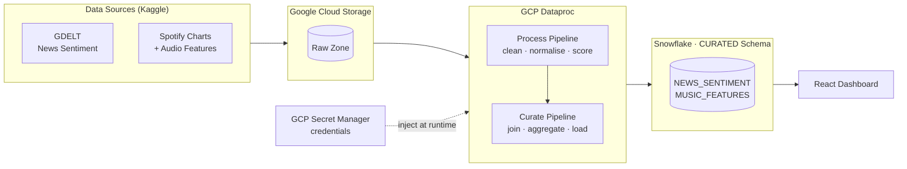
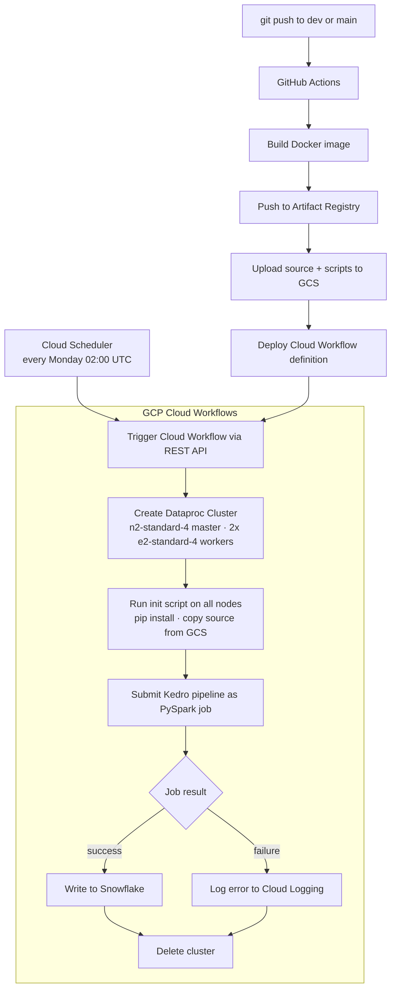

<div align="center">


<br/><br/>

**Does what's happening in the world change what we listen to?**

*MSBA 405 · UCLA Anderson · Team 17 · 2026*

[](https://www.python.org/)
[](https://kedro.org)
[](https://spark.apache.org/)
[](https://www.snowflake.com/)
[](https://cloud.google.com/)
[](https://github.com/features/actions)

</div>

---

## The Question

Global events — pandemics, elections, economic crises, social movements — shape the emotional climate of a society. Music streaming, now the dominant mode of music consumption, reflects cultural mood in near real time. This project asks: **can we quantify the relationship between what the world is talking about and what people choose to listen to?**

We correlate daily news sentiment derived from the GDELT Knowledge Graph Database (GKG Database based on news articles) with Spotify streaming charts and audio features across six English-speaking countries from 2017 to 2020 — a period that spans Brexit, COVID-19, and major geopolitical shifts.

---

## Table of Contents

1. [Data Sources](#1-data-sources)
2. [Architecture](#2-architecture)
3. [Prerequisites](#3-prerequisites)
4. [Local Setup](#4-local-setup)
5. [Running the Pipeline Locally](#5-running-the-pipeline-locally)
6. [Production Setup (GCP + Snowflake)](#6-production-setup-gcp--snowflake)
7. [Running the Pipeline on GCP](#7-running-the-pipeline-on-gcp)
8. [CI/CD](#8-cicd)
9. [Project Structure](#9-project-structure)
10. [Dashboard](#10-dashboard)

---

## 1. Data Sources

The pipeline uses three datasets. All are publicly available on Kaggle — no special access required.

| Dataset | Kaggle URL | Local path after download |
|---|---|---|
| Spotify Charts (daily top-200 per country) | [URL](https://www.kaggle.com/datasets/dhruvildave/spotify-charts)| `data/01_raw/charts_full.csv` |
| Spotify Audio Features (12M tracks) | [URL](https://www.kaggle.com/datasets/rodolfofigueroa/spotify-12m-songs) | `data/01_raw/audio_features.csv` |
| GDELT Daily Emotions (news sentiment) | [URL](https://www.kaggle.com/datasets/nivesh22/gdelt-daily-emotions) | `data/01_raw/gdelt.csv` |

**To download all three automatically**, follow the steps in [Section 4](#4-local-setup).

---

## 2. Architecture

### Pipeline Architecture



### CI/CD Flow



---

## 3. Prerequisites

All code required to reproduce the project is included in this repository, including pipeline code, setup scripts, cloud workflow definitions, CI/CD configuration, initialization scripts, and Snowflake SQL used for warehouse setup. The pipeline also maintains atomic writes to Snowflake, ensuring that tables are updated only after successful pipeline completion to prevent partial or inconsistent data states.

### Accounts you need

| Service | Purpose | Sign up |
|---|---|---|
| Kaggle | Download the three datasets | https://www.kaggle.com/account/login — go to **Settings → API → Create New Token** to get `kaggle.json` |
| Google Cloud | Dataproc, GCS, Secret Manager, Cloud Workflows | https://console.cloud.google.com |
| Snowflake | Final data warehouse | https://signup.snowflake.com |

### Local software

| Tool | Version | Install |
|---|---|---|
| Python | 3.11+ | https://www.python.org/downloads/ |
| Java JDK | **17 exactly** | `brew install openjdk@17` — JDK 21+ breaks PySpark Arrow integration |
| uv | latest | `pip install uv` |
| gcloud CLI | latest | https://cloud.google.com/sdk/docs/install |

---

## 4. Local Setup

```bash
# 1. Clone the repository
git clone https://github.com/Prof-Rosario-UCLA/team17.git
cd team17

# 2. Install all dependencies (creates .venv automatically)
make setup

# 3. Place your Kaggle credentials
mkdir -p ~/.kaggle
cp /path/to/your/kaggle.json ~/.kaggle/kaggle.json
chmod 600 ~/.kaggle/kaggle.json

# 4a. Download sample data (5,000 rows per dataset — runs in under a minute)
make samples

# 4b. OR download the full datasets (~1 GB total)
make full-data
```

After `make samples`, the following files exist:

```
data/01_raw/
├── gdelt.csv                ← GDELT news sentiment
├── charts_sample.csv   ← Spotify Charts (5K rows)
└── audio_features.csv       ← Spotify Audio Features (5K rows)
```

---

## 5. Running the Pipeline Locally

Local runs use **Spark in `local[*]` mode** and write outputs to **DuckDB** (`data/local.db`). No cloud credentials needed.

```bash
# Run the full pipeline (process + curate) — one command
make run-local
```

That's it. `make run-local` deletes any previous `data/local.db`, runs `kedro run`, and writes the two output tables.

To run individual stages:

```bash
make run-process   # clean raw data only
make run-curate    # join + aggregate + load only
```

To inspect the output tables:

```bash
make inspect-local
```

### Output schema

**`NEWS_SENTIMENT`** — one row per `(date, country)`:

| Column | Description |
|---|---|
| `date`, `country` | Identifiers |
| `article_count` | GDELT articles that day |
| `avg_tone_score` | Avg GDELT tone (positive = good news) |
| `avg_emotion_anger/fear/joy/sadness/…` | Averaged emotion scores |

**`MUSIC_FEATURES`** — one row per `(date, country)`:

| Column | Description |
|---|---|
| `date`, `country` | Identifiers |
| `total_streams`, `track_count` | Coverage metadata |
| `emotion_coverage`, `coverage_flag` | Fraction of streams with scored tracks (`OK` / `LOW_COVERAGE` / `VERY_LOW`) |
| `o2_valence`, `o2_energy`, `o2_danceability`, `o2_acoustics`, `o2_liveliness`, `o2_tempo` | Stream-weighted audio feature averages |
| `o3_anger`, `o3_joy`, `o3_sadness`, `o3_fear`, `o3_trust`, `o3_surprise`, `o3_anticipation`, `o3_disgust` | Stream-weighted NRC emotion averages |
| `o3_celebrate`, `o3_desire`, `o3_explore`, `o3_fun`, `o3_hope`, `o3_love`, `o3_nostalgia`, `o3_thug` | Stream-weighted LDA topic averages |

---

## 6. Production Setup (GCP + Snowflake)

This is a one-time setup. Once complete, every `git push` to `main` or `dev` runs the full pipeline automatically end-to-end.

### 6a. Snowflake — create schema

Log in to your Snowflake account and run:

```sql
CREATE DATABASE IF NOT EXISTS SOCIETY_TO_MUSIC;
CREATE SCHEMA IF NOT EXISTS SOCIETY_TO_MUSIC.CURATED;
CREATE WAREHOUSE IF NOT EXISTS COMPUTE_WH
  WAREHOUSE_SIZE = 'XSMALL'
  AUTO_SUSPEND = 60
  AUTO_RESUME = TRUE;
```

Note your **account identifier** (format: `orgname-accountname`, visible in the URL), username, password, warehouse name, role, database, and schema. You will need all seven values in the next step.

The pipeline creates the `NEWS_SENTIMENT` and `MUSIC_FEATURES` tables automatically on first run.

### 6b. GCP — project and service account

Replace `YOUR_PROJECT_ID` and `YOUR_BUCKET_NAME` throughout:

```bash
gcloud auth login
gcloud config set project YOUR_PROJECT_ID

# Enable required APIs
gcloud services enable \
  dataproc.googleapis.com \
  workflows.googleapis.com \
  secretmanager.googleapis.com \
  artifactregistry.googleapis.com \
  cloudscheduler.googleapis.com \
  storage.googleapis.com

# Create GCS bucket
gsutil mb -l us-central1 gs://YOUR_BUCKET_NAME

# Create Artifact Registry Docker repository
gcloud artifacts repositories create society-to-music \
  --repository-format=docker \
  --location=us-central1

# Create service account
gcloud iam service-accounts create kedro-pipeline \
  --display-name="Kedro Pipeline Service Account"

SA="kedro-pipeline@YOUR_PROJECT_ID.iam.gserviceaccount.com"

# Grant all required roles in one block
for ROLE in \
  roles/dataproc.editor \
  roles/dataproc.worker \
  roles/storage.objectAdmin \
  roles/secretmanager.secretAccessor \
  roles/logging.logWriter \
  roles/workflows.editor \
  roles/workflows.invoker \
  roles/artifactregistry.reader \
  roles/artifactregistry.writer \
  roles/iam.serviceAccountUser \
  roles/cloudscheduler.jobRunner; do
  gcloud projects add-iam-policy-binding YOUR_PROJECT_ID \
    --member="serviceAccount:${SA}" --role="${ROLE}"
done

# Bucket-level read for Dataproc staging/temp buckets
gcloud storage buckets add-iam-policy-binding gs://YOUR_BUCKET_NAME \
  --member="serviceAccount:${SA}" \
  --role="roles/storage.legacyBucketReader"

# Download service account key for GitHub Actions
gcloud iam service-accounts keys create kedro-key.json \
  --iam-account="${SA}"
```

### 6c. Store Snowflake credentials in Secret Manager

```bash
PROJECT_ID="YOUR_PROJECT_ID"

echo -n "orgname-accountname"  | gcloud secrets create SNOWFLAKE_ACCOUNT   --data-file=- --project=$PROJECT_ID
echo -n "your_username"        | gcloud secrets create SNOWFLAKE_USER       --data-file=- --project=$PROJECT_ID
echo -n "your_password"        | gcloud secrets create SNOWFLAKE_PASSWORD   --data-file=- --project=$PROJECT_ID
echo -n "COMPUTE_WH"           | gcloud secrets create SNOWFLAKE_WAREHOUSE  --data-file=- --project=$PROJECT_ID
echo -n "ACCOUNTADMIN"         | gcloud secrets create SNOWFLAKE_ROLE       --data-file=- --project=$PROJECT_ID
echo -n "SOCIETY_TO_MUSIC"     | gcloud secrets create SNOWFLAKE_DATABASE   --data-file=- --project=$PROJECT_ID
echo -n "CURATED"              | gcloud secrets create SNOWFLAKE_SCHEMA     --data-file=- --project=$PROJECT_ID
```

### 6d. Upload raw data to GCS

```bash
BUCKET="gs://YOUR_BUCKET_NAME"

gsutil cp data/01_raw/gdelt.csv           ${BUCKET}/Raw/gdelt/gdelt.csv
gsutil cp data/01_raw/charts_full.csv ${BUCKET}/Raw/Spotify_charts/charts.csv
gsutil cp data/01_raw/audio_features.csv  ${BUCKET}/Raw/audio_features/audio_features.csv
```

### 6e. Update `conf/base/catalog.yml` with your bucket

Open `conf/base/catalog.yml` and replace `msba405-society-music-2026` with `YOUR_BUCKET_NAME` in all three `filepath` values.

### 6f. Add GitHub Actions secrets

In your GitHub repo: **Settings → Secrets and variables → Actions → New repository secret**

| Secret name | Value |
|---|---|
| `GCP_PROJECT_ID` | Your GCP project ID |
| `GCP_SERVICE_ACCOUNT_KEY` | Full JSON content of `kedro-key.json` |
| `GCS_BUCKET` | Your bucket name (without `gs://`) |

### 6g. Deploy the Cloud Workflow (one-time)

```bash
gcloud workflows deploy run-pipeline \
  --location=us-central1 \
  --source=infra/pipeline_workflow.yaml \
  --service-account=kedro-pipeline@YOUR_PROJECT_ID.iam.gserviceaccount.com
```

---

## 7. Running the Pipeline on GCP

### Trigger via git push (automatic after setup)

```bash
git push origin main
```

GitHub Actions handles everything: build → push image → upload source → deploy workflow → trigger pipeline.

### Trigger manually from the CLI

```bash
gcloud workflows run run-pipeline \
  --location=us-central1 \
  --data='{"image_tag":"latest","branch":"main"}'
```

### Trigger from GCP Console

**Cloud Workflows → run-pipeline → Execute**, input:
```json
{"image_tag": "latest", "branch": "main"}
```

### Set up a weekly schedule

```bash
make schedule          # Runs every Monday 02:00 UTC
make delete-schedule   # Remove it
```

### Monitor logs

```bash
make logs
# Equivalent to:
gcloud logging read "resource.type=cloud_dataproc_job" \
  --project=YOUR_PROJECT_ID --limit=50 \
  --format="table(timestamp,severity,textPayload)"
```

Or in the GCP Console: **Cloud Logging → Logs Explorer**, query:
```
resource.type="cloud_dataproc_job"
severity>=ERROR
```

---

## 8. CI/CD

Every push to `main` or `dev` runs `.github/workflows/docker.yml`:

| Step | Trigger | What it does |
|---|---|---|
| Build dev image | Pull request | Builds `--target dev` to validate Dockerfile — does not push |
| Build + push production image | Push to main/dev | Builds `--target main`, tags with git SHA + `latest`/`dev-latest`, pushes to Artifact Registry |
| Upload artifacts to GCS | Push to main/dev | Uploads `scripts/`, `src/`, `conf/`, `requirements.txt`, `pyproject.toml` |
| Deploy Cloud Workflow | Push to main/dev | Re-deploys `infra/pipeline_workflow.yaml` — keeps GCP in sync with the repo |
| Trigger pipeline | Push to main/dev | Fires the Cloud Workflow via REST API (fire-and-forget, does not block CI) |

---

## 9. Project Structure

```
/
├── src/society_to_music/
│   ├── hooks.py                              # SparkHook + GCP Secret Manager loader
│   ├── settings.py                           # Kedro hooks registration
│   ├── pipeline_registry.py                  # Pipeline registration
│   ├── utils/logging.py                      # @log_node decorator
│   └── pipelines/
│       ├── process/
│       │   ├── clean_gdelt.py                # GDELT cleaning node
│       │   ├── clean_spotify.py              # Spotify charts + audio features join
│       │   ├── clean_audio_features.py       # Audio features cleaning node
│       │   └── pipeline.py
│       └── curate/
│           ├── join_and_aggregate_charts_music_features.py
│           └── pipeline.py
├── conf/
│   ├── base/                                 # Production (GCS + Snowflake)
│   │   ├── catalog.yml
│   │   ├── parameters.yml
│   │   └── credentials.yml                  # ${oc.env:VAR} interpolation — no secrets in git
│   └── local/                               # Local dev (csv + DuckDB)
│       ├── catalog.yml
│       └── credentials.yml
├── scripts/
│   ├── download_samples.py                   # Kaggle data downloader
│   ├── dataproc_init.sh                      # Cluster init script (runs on all nodes)
│   ├── dataproc_run.py                       # PySpark job entry point
│   ├── check_before_commit.py                # Pre-commit checks
│   └── inspect_local_db.py                  # Query DuckDB output
├── infra/
│   └── pipeline_workflow.yaml               # GCP Cloud Workflows definition
├── .github/workflows/
│   └── docker.yml                           # CI/CD pipeline
├── app/                                     # React visualization app
├── Dockerfile                               # Multi-stage: base → dev / main
├── Makefile                                 # All common commands
├── requirements.txt                         # Pinned runtime dependencies
└── requirements-dev.txt                     # Dev tools (jupyter, pytest, ruff, etc.)
```

### Makefile reference

This section lists the common make commands used to simplify development tasks such as installing dependencies, running the data pipeline locally, downloading datasets, testing, linting, inspecting outputs, and managing cloud jobs.

```bash
make setup            # Install all dependencies
make samples          # Download 5K-row sample data from Kaggle
make full-data        # Download complete datasets from Kaggle
make run-local        # Run full pipeline locally (Spark local[*] + DuckDB)
make run-process      # Run only the process pipeline
make run-curate       # Run only the curate pipeline
make test             # pytest with coverage
make lint             # Ruff linter
make check            # Format + lint + tests
make viz              # Kedro-Viz pipeline graph in browser
make inspect-local    # Query local DuckDB output
make logs             # View Dataproc logs from Cloud Logging
make schedule         # Create Cloud Scheduler weekly job
make delete-schedule  # Remove the scheduler job
```

---
## 10. Dashboard

Live dashboard: https://society-to-music-app-3s75ykncka-uc.a.run.app/

The `app/` directory contains a React + FastAPI visualization dashboard. The React frontend is built at Docker image build time and served as static files by FastAPI — there is no separate web server.

### 10a. Running locally

**Step 1** — create `app/.env` with your Snowflake credentials:

```bash
SNOWFLAKE_ACCOUNT=orgname-accountname
SNOWFLAKE_USER=your_username
SNOWFLAKE_PASSWORD=your_password
SNOWFLAKE_WAREHOUSE=COMPUTE_WH
SNOWFLAKE_ROLE=ACCOUNTADMIN
SNOWFLAKE_DATABASE=SOCIETY_TO_MUSIC
SNOWFLAKE_SCHEMA=CURATED
```

**Step 2** — start the backend (from repo root):

```bash
cd app
uvicorn production.api:app --reload --port 8000
```

**Step 3** — start the frontend in a second terminal:

```bash
cd app
npm install      # first time only
npm run dev      # starts Vite dev server at http://localhost:5173
```

Open http://localhost:5173. API calls go through a Vite proxy to `http://localhost:8000`.

### 10b. Deploying to Cloud Run

Deployment is automatic via GitHub Actions — any push to `main` or `dev` that touches `app/**` builds and deploys the Docker image.

**Prerequisites:** complete the GCP and Snowflake setup in [Section 6](#6-production-setup-gcp--snowflake), and ensure `GCP_PROJECT_ID` and `GCP_SERVICE_ACCOUNT_KEY` are set as GitHub Actions secrets.

**Make the service public (one-time):**

After the first deployment, run:

```bash
gcloud run services add-iam-policy-binding society-to-music-app \
  --region=us-central1 \
  --member="allUsers" \
  --role="roles/run.invoker"
```

**Get the service URL:**

```bash
gcloud run services describe society-to-music-app \
  --region=us-central1 \
  --format="value(status.url)"
```

### 10c. How it works in production

```
Browser
  └── GET /*       → Cloud Run (port 8080)
        ├── GET /api/*  → FastAPI → Snowflake (credentials from Secret Manager)
        └── GET /*      → React SPA (index.html served by FastAPI catch-all)
```

Snowflake credentials are pulled from GCP Secret Manager at startup (`USE_SECRET_MANAGER=true` is set automatically by the workflow — no `.env` file needed in production).
